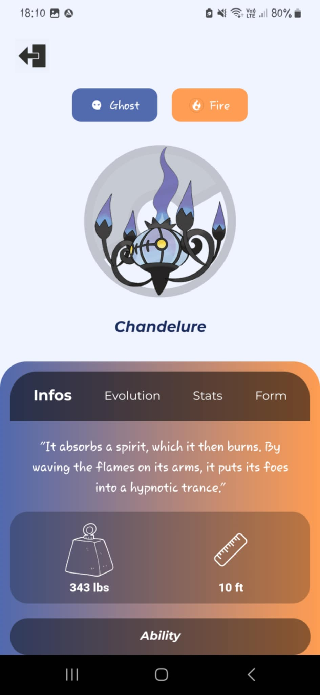
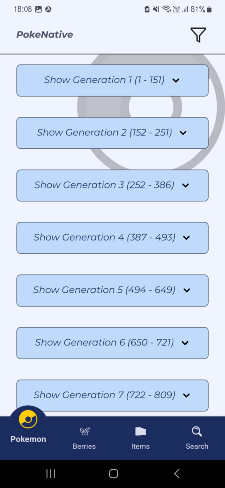
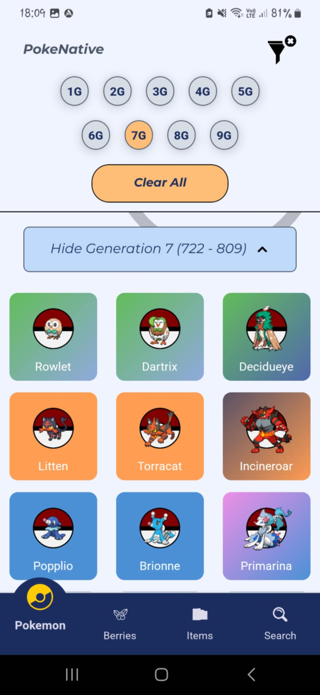
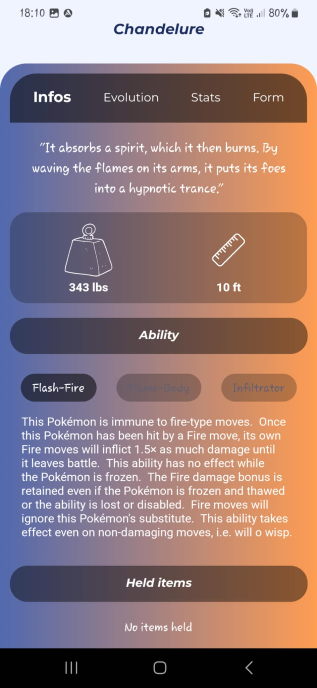
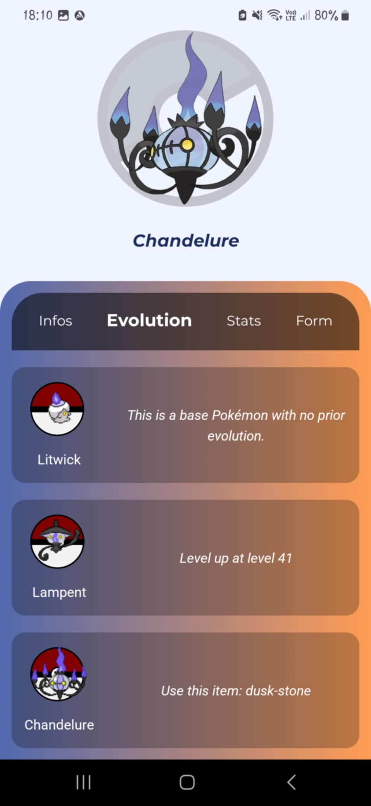
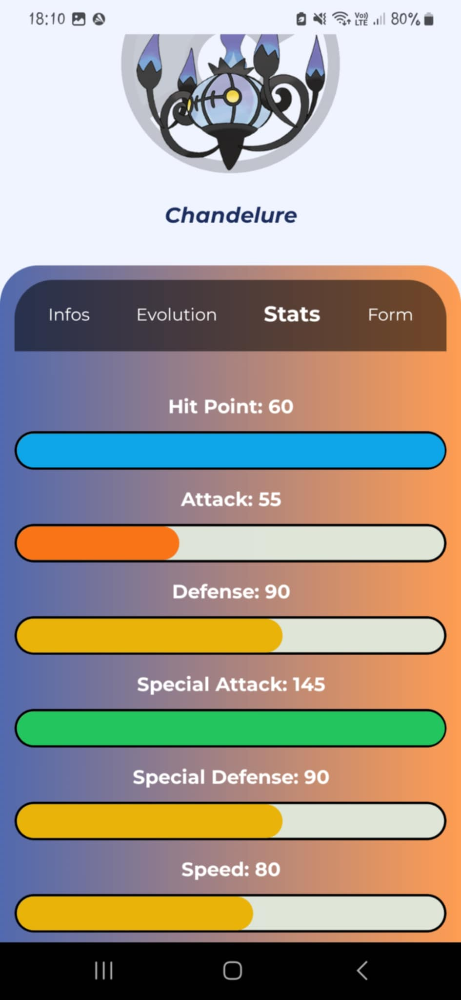
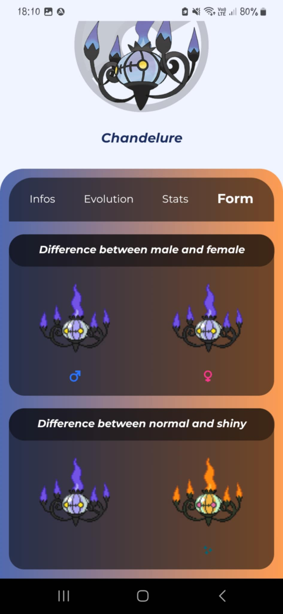

# PokeNative

  

   

[TODO]

## Overview of Pokemon tab

<table align="center">
   <tr>
      <th>List of pokemons by region</th>
      <th>List of pokemons in a region</th>
      <th>Filter pokemons by region</th>
   </tr>
   <tr>
      <td align="center"></td>
      <td align="center"></td>
      <td align="center"></td>
   </tr>
</table>

<table align="center">
   <tr>
      <th>Informations</th>
      <th>Evolution Chain</th>
      <th>Statistics of base</th>
      <th>Alternative forms</th>
   </tr>
   <tr>
      <td align="center"></td>
      <td align="center"></td>
      <td align="center"></td>
      <td align="center"></td>
   </tr>
</table>

## Overview of Berry tab

[TODO]

## Overview of Items tab

[TODO]

## Overview of Search tab

[TODO]

## Technologies

- React Native
- NativeWind
- PokeAPI